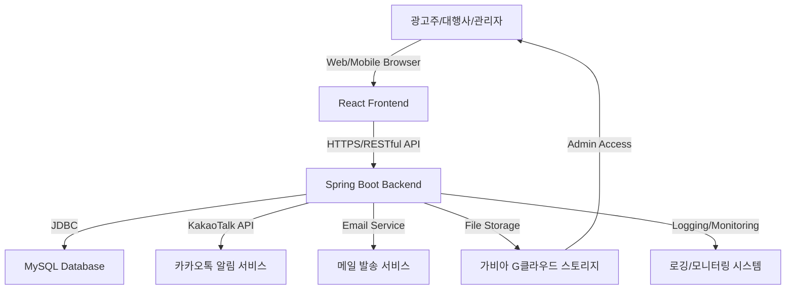

# 플레이스 상위노출 입찰 사이트 MVP 모델 설계 문서

## 1. 아키텍처 개요 (Architecture Overview)

이 문서는 네이버 플레이스 상위노출 광고 입찰 웹앱의 MVP (Minimum Viable Product) 모델에 대한 기술 설계를 정의합니다. 시스템은 확장성과 안정성을 고려하여 백엔드(Java/Spring Boot), 데이터베이스(MySQL), 프론트엔드(React) 및 클라우드 인프라(가비아 G클라우드)로 구성됩니다.

### 1.1 시스템 구성도

### 1.2 주요 모듈 및 역할

- **프론트엔드 (React):** 사용자 인터페이스를 제공하며, 백엔드 API와 통신하여 데이터를 주고받습니다.
- **백엔드 (Spring Boot):** 비즈니스 로직 처리, 데이터베이스 연동, 외부 서비스(카카오톡, 메일) 연동, 인증/인가 관리 등 핵심 기능을 담당합니다.
- **데이터베이스 (MySQL):** 모든 애플리케이션 데이터를 저장하고 관리합니다.
- **카카오톡 알림 서비스:** 사용자에게 실시간 알림을 보냅니다.
- **메일 발송 서비스:** 계약서 발송 등 이메일 통신을 처리합니다.
- **가비아 G클라우드 스토리지:** 포트폴리오 파일 등 정적 파일 저장을 담당합니다.
- **로깅/모니터링 시스템:** 시스템 운영 상태 및 오류를 기록하고 모니터링합니다.

## 2. 데이터베이스 설계 (Database Design)

MySQL을 기반으로 주요 엔티티 및 테이블을 설계합니다.

### 2.1 사용자 (User) 테이블 (User)

모든 사용자(광고주, 대행사, 관리자)의 기본 정보를 저장합니다.

| 필드명 (Column Name)  | 데이터 타입 (Data Type) | 제약조건 (Constraints) | 설명 (Description)                      |
| :-------------------- | :---------------------- | :--------------------- | :-------------------------------------- |
| `user_id`             | BIGINT                  | PK, AUTO_INCREMENT     | 사용자 고유 ID                          |
| `email`               | VARCHAR(255)            | UNIQUE, NOT NULL       | 이메일 (로그인 ID)                      |
| `password`            | VARCHAR(255)            | NULL                   | 비밀번호 (일반 회원가입 시)             |
| `social_type`         | VARCHAR(50)             | NULL                   | 소셜 로그인 타입 (NAVER, KAKAO)         |
| `social_id`           | VARCHAR(255)            | NULL                   | 소셜 로그인 ID                          |
| `user_type`           | VARCHAR(50)             | NOT NULL               | 사용자 유형 (ADVERTISER, AGENCY, ADMIN) |
| `name`                | VARCHAR(100)            | NOT NULL               | 사용자 이름 (담당자 이름)               |
| `phone_number`        | VARCHAR(50)             | NOT NULL               | 연락처                                  |
| `company_name`        | VARCHAR(255)            | NOT NULL               | 상호명                                  |
| `registration_number` | VARCHAR(20)             | NOT NULL               | 사업자등록번호                          |
| `account_number`      | VARCHAR(50)             | NULL                   | 계좌번호 (대행사만)                     |
| `bank_name`           | VARCHAR(100)            | NULL                   | 은행명 (대행사만)                       |
| `status`              | VARCHAR(50)             | NOT NULL               | 계정 상태 (ACTIVE, INACTIVE, SUSPENDED) |
| `created_at`          | DATETIME                | NOT NULL               | 생성 일시                               |
| `updated_at`          | DATETIME                | NOT NULL               | 최종 수정 일시                          |

### 2.2 입찰 (Bid) 테이블 (Bid)

광고주가 생성하는 플레이스 상위노출 입찰 요청 정보입니다.

| 필드명 (Column Name) | 데이터 타입 (Data Type) | 제약조건 (Constraints) | 설명 (Description)                                      |
| :------------------- | :---------------------- | :--------------------- | :------------------------------------------------------ |
| `bid_id`             | BIGINT                  | PK, AUTO_INCREMENT     | 입찰 고유 ID                                            |
| `advertiser_id`      | BIGINT                  | FK (User.user_id)      | 광고주 ID                                               |
| `place_link`         | VARCHAR(500)            | NOT NULL               | 네이버 플레이스 링크                                    |
| `desired_rank`       | VARCHAR(50)             | NOT NULL               | 희망 노출 순위 (1-5위, 1-10위 등)                       |
| `keyword`            | VARCHAR(255)            | NOT NULL               | 희망 키워드                                             |
| `status`             | VARCHAR(50)             | NOT NULL               | 입찰 상태 (PENDING, ACTIVE, CLOSED, SELECTED, CANCELED) |
| `expires_at`         | DATETIME                | NOT NULL               | 입찰 마감 일시                                          |
| `selected_agency_id` | BIGINT                  | FK (User.user_id)      | 선정된 대행사 ID (NULL 허용)                            |
| `created_at`         | DATETIME                | NOT NULL               | 생성 일시                                               |
| `updated_at`         | DATETIME                | NOT NULL               | 최종 수정 일시                                          |

### 2.3 제안 (Proposal) 테이블 (Proposal)

대행사가 입찰에 대해 제안하는 정보입니다.

| 필드명 (Column Name) | 데이터 타입 (Data Type) | 제약조건 (Constraints) | 설명 (Description)                                  |
| :------------------- | :---------------------- | :--------------------- | :-------------------------------------------------- |
| `proposal_id`        | BIGINT                  | PK, AUTO_INCREMENT     | 제안 고유 ID                                        |
| `bid_id`             | BIGINT                  | FK (Bid.bid_id)        | 입찰 ID                                             |
| `agency_id`          | BIGINT                  | FK (User.user_id)      | 제안한 대행사 ID                                    |
| `proposed_price`     | DECIMAL(10, 2)          | NOT NULL               | 제안 가격 (VAT 포함)                                |
| `status`             | VARCHAR(50)             | NOT NULL               | 제안 상태 (SUBMITTED, MODIFIED, SELECTED, REJECTED) |
| `created_at`         | DATETIME                | NOT NULL               | 생성 일시                                           |
| `updated_at`         | DATETIME                | NOT NULL               | 최종 수정 일시                                      |

### 2.4 결제 (Payment) 테이블 (Payment)

광고주가 플랫폼에 입금하는 결제 정보입니다.

| 필드명 (Column Name) | 데이터 타입 (Data Type) | 제약조건 (Constraints) | 설명 (Description)                       |
| :------------------- | :---------------------- | :--------------------- | :--------------------------------------- |
| `payment_id`         | BIGINT                  | PK, AUTO_INCREMENT     | 결제 고유 ID                             |
| `bid_id`             | BIGINT                  | FK (Bid.bid_id)        | 입찰 ID                                  |
| `advertiser_id`      | BIGINT                  | FK (User.user_id)      | 광고주 ID                                |
| `agency_id`          | BIGINT                  | FK (User.user_id)      | 대행사 ID (정산 대상)                    |
| `amount`             | DECIMAL(10, 2)          | NOT NULL               | 결제 금액 (VAT 포함, 수수료 포함)        |
| `platform_fee`       | DECIMAL(10, 2)          | NOT NULL               | 플랫폼 수수료                            |
| `payment_method`     | VARCHAR(50)             | NOT NULL               | 결제 수단 (BANK_TRANSFER)                |
| `status`             | VARCHAR(50)             | NOT NULL               | 결제 상태 (PENDING, COMPLETED, REFUNDED) |
| `paid_at`            | DATETIME                | NULL                   | 결제 완료 일시                           |
| `created_at`         | DATETIME                | NOT NULL               | 생성 일시                                |
| `updated_at`         | DATETIME                | NOT NULL               | 최종 수정 일시                           |

### 2.5 정산 (Settlement) 테이블 (Settlement)

플랫폼이 대행사에게 정산하는 정보입니다.

| 필드명 (Column Name)   | 데이터 타입 (Data Type) | 제약조건 (Constraints)  | 설명 (Description)                                               |
| :--------------------- | :---------------------- | :---------------------- | :--------------------------------------------------------------- |
| `settlement_id`        | BIGINT                  | PK, AUTO_INCREMENT      | 정산 고유 ID                                                     |
| `payment_id`           | BIGINT                  | FK (Payment.payment_id) | 결제 ID                                                          |
| `agency_id`            | BIGINT                  | FK (User.user_id)       | 대행사 ID                                                        |
| `settlement_amount`    | DECIMAL(10, 2)          | NOT NULL                | 정산 금액                                                        |
| `proof_screenshot_url` | VARCHAR(500)            | NULL                    | 노출 증빙 스크린샷 URL                                           |
| `status`               | VARCHAR(50)             | NOT NULL                | 정산 상태 (PENDING_PROOF, PENDING_APPROVAL, COMPLETED, REJECTED) |
| `settled_at`           | DATETIME                | NULL                    | 정산 완료 일시                                                   |
| `admin_checked_at`     | DATETIME                | NULL                    | 관리자 검수 일시                                                 |
| `created_at`           | DATETIME                | NOT NULL                | 생성 일시                                                        |
| `updated_at`           | DATETIME                | NOT NULL                | 최종 수정 일시                                                   |

### 2.6 리뷰 (Review) 테이블 (Review)

광고주가 대행사에게 작성하는 리뷰 정보입니다.

| 필드명 (Column Name) | 데이터 타입 (Data Type) | 제약조건 (Constraints) | 설명 (Description)                  |
| :------------------- | :---------------------- | :--------------------- | :---------------------------------- |
| `review_id`          | BIGINT                  | PK, AUTO_INCREMENT     | 리뷰 고유 ID                        |
| `advertiser_id`      | BIGINT                  | FK (User.user_id)      | 리뷰 작성 광고주 ID                 |
| `agency_id`          | BIGINT                  | FK (User.user_id)      | 리뷰 대상 대행사 ID                 |
| `bid_id`             | BIGINT                  | FK (Bid.bid_id)        | 관련 입찰 ID (선택 사항)            |
| `rating`             | INT                     | NOT NULL               | 평점 (1-5점)                        |
| `comment`            | TEXT                    | NULL                   | 리뷰 내용                           |
| `status`             | VARCHAR(50)             | NOT NULL               | 리뷰 상태 (ACTIVE, HIDDEN, DELETED) |
| `created_at`         | DATETIME                | NOT NULL               | 생성 일시                           |
| `updated_at`         | DATETIME                | NOT NULL               | 최종 수정 일시                      |

### 2.7 포트폴리오 (Portfolio) 테이블 (Portfolio)

대행사가 등록하는 포트폴리오 정보입니다.

| 필드명 (Column Name) | 데이터 타입 (Data Type) | 제약조건 (Constraints) | 설명 (Description)                          |
| :------------------- | :---------------------- | :--------------------- | :------------------------------------------ |
| `portfolio_id`       | BIGINT                  | PK, AUTO_INCREMENT     | 포트폴리오 고유 ID                          |
| `agency_id`          | BIGINT                  | FK (User.user_id)      | 대행사 ID                                   |
| `title`              | VARCHAR(255)            | NOT NULL               | 포트폴리오 제목                             |
| `description`        | TEXT                    | NULL                   | 설명                                        |
| `file_url`           | VARCHAR(500)            | NOT NULL               | PDF 파일 URL                                |
| `status`             | VARCHAR(50)             | NOT NULL               | 상태 (PENDING_APPROVAL, APPROVED, REJECTED) |
| `admin_memo`         | TEXT                    | NULL                   | 관리자 검수 코멘트                          |
| `created_at`         | DATETIME                | NOT NULL               | 생성 일시                                   |
| `updated_at`         | DATETIME                | NOT NULL               | 최종 수정 일시                              |

### 2.8 알림 (Notification) 테이블 (Notification)

사용자에게 전송되는 알림 정보입니다.

| 필드명 (Column Name) | 데이터 타입 (Data Type) | 제약조건 (Constraints) | 설명 (Description)                                               |
| :------------------- | :---------------------- | :--------------------- | :--------------------------------------------------------------- |
| `notification_id`    | BIGINT                  | PK, AUTO_INCREMENT     | 알림 고유 ID                                                     |
| `user_id`            | BIGINT                  | FK (User.user_id)      | 수신 사용자 ID                                                   |
| `type`               | VARCHAR(50)             | NOT NULL               | 알림 유형 (PROPOSAL_RECEIVED, BID_EXPIRES_SOON, AGENCY_SELECTED) |
| `message`            | TEXT                    | NOT NULL               | 알림 내용                                                        |
| `is_read`            | BOOLEAN                 | DEFAULT FALSE          | 읽음 여부                                                        |
| `sent_at`            | DATETIME                | NOT NULL               | 전송 일시                                                        |

### 2.9 채팅 (Chat Room) 테이블 (ChatRoom)

광고주와 선정된 대행사 간 1:1 채팅방 정보입니다.

| 필드명 (Column Name) | 데이터 타입 (Data Type) | 제약조건 (Constraints) | 설명 (Description) |
| :------------------- | :---------------------- | :--------------------- | :----------------- |
| `chat_room_id`       | BIGINT                  | PK, AUTO_INCREMENT     | 채팅방 고유 ID     |
| `bid_id`             | BIGINT                  | FK (Bid.bid_id)        | 관련 입찰 ID       |
| `advertiser_id`      | BIGINT                  | FK (User.user_id)      | 광고주 ID          |
| `agency_id`          | BIGINT                  | FK (User.user_id)      | 대행사 ID          |
| `created_at`         | DATETIME                | NOT NULL               | 생성 일시          |

### 2.10 채팅 메시지 (Chat Message) 테이블 (ChatMessage)

채팅방 내의 메시지 내용입니다.

| 필드명 (Column Name) | 데이터 타입 (Data Type) | 제약조건 (Constraints)     | 설명 (Description)        |
| :------------------- | :---------------------- | :------------------------- | :------------------------ |
| `message_id`         | BIGINT                  | PK, AUTO_INCREMENT         | 메시지 고유 ID            |
| `chat_room_id`       | BIGINT                  | FK (ChatRoom.chat_room_id) | 채팅방 ID                 |
| `sender_id`          | BIGINT                  | FK (User.user_id)          | 발신자 ID                 |
| `message_content`    | TEXT                    | NOT NULL                   | 메시지 내용               |
| `file_url`           | VARCHAR(500)            | NULL                       | 첨부 파일 URL (선택 사항) |
| `sent_at`            | DATETIME                | NOT NULL                   | 전송 일시                 |

## 3. API 설계 (API Design)

RESTful API 원칙을 준수하여 설계하며, Swagger/OpenAPI를 통해 문서화합니다. JWT 기반 인증을 사용합니다.

### 3.1 사용자 (User) API

- `POST /api/v1/users/register`: 회원가입 (이메일, 소셜)
- `POST /api/v1/users/login`: 로그인
- `GET /api/v1/users/me`: 내 정보 조회
- `PUT /api/v1/users/me`: 내 정보 수정
- `GET /api/v1/users/{user_id}`: 특정 사용자 정보 조회 (관리자용)

### 3.2 광고주 (Advertiser) API

- `POST /api/v1/advertisers/bids`: 입찰 요청 등록
- `GET /api/v1/advertisers/bids`: 내 입찰 요청 목록 조회
- `GET /api/v1/advertisers/bids/{bid_id}`: 특정 입찰 요청 상세 조회
- `PUT /api/v1/advertisers/bids/{bid_id}/select`: 대행사 선정
- `GET /api/v1/advertisers/payments`: 내 결제 내역 조회
- `POST /api/v1/advertisers/reviews`: 대행사 리뷰 작성
- `GET /api/v1/advertisers/reviews`: 내 리뷰 목록 조회

### 3.3 대행사 (Agency) API

- `GET /api/v1/agencies/bids`: 전체 입찰 요청 목록 조회
- `GET /api/v1/agencies/bids/{bid_id}`: 특정 입찰 요청 상세 조회 (제안된 가격 포함)
- `POST /api/v1/agencies/bids/{bid_id}/proposals`: 입찰 제안 제출
- `PUT /api/v1/agencies/proposals/{proposal_id}`: 입찰 제안 수정
- `POST /api/v1/agencies/portfolios`: 포트폴리오 등록
- `PUT /api/v1/agencies/portfolios/{portfolio_id}`: 포트폴리오 수정
- `GET /api/v1/agencies/portfolios`: 내 포트폴리오 목록 조회
- `GET /api/v1/agencies/settlements`: 내 정산 내역 조회
- `POST /api/v1/agencies/settlements/{settlement_id}/proof`: 정산 증빙 스크린샷 제출

### 3.4 알림 (Notification) API

- `GET /api/v1/notifications`: 내 알림 목록 조회
- `PUT /api/v1/notifications/{notification_id}/read`: 알림 읽음 처리

### 3.5 채팅 (Chat) API

- `GET /api/v1/chatrooms`: 내 채팅방 목록 조회
- `GET /api/v1/chatrooms/{chatroom_id}/messages`: 특정 채팅방 메시지 조회
- `POST /api/v1/chatrooms/{chatroom_id}/messages`: 메시지 전송
- `POST /api/v1/chatrooms/{chatroom_id}/files`: 파일 첨부

### 3.6 관리자 (Admin) API

관리자 권한으로만 접근 가능합니다.

- `GET /api/v1/admin/users`: 모든 사용자 조회 및 검색
- `PUT /api/v1/admin/users/{user_id}/status`: 사용자 상태 변경 (활성/비활성/정지)
- `DELETE /api/v1/admin/users/{user_id}`: 사용자 삭제
- `GET /api/v1/admin/bids`: 모든 입찰 조회
- `PUT /api/v1/admin/bids/{bid_id}/status`: 입찰 상태 변경 (승인, 강제 종료 등)
- `GET /api/v1/admin/payments`: 모든 결제 내역 조회
- `PUT /api/v1/admin/settlements/{settlement_id}/approve`: 정산 승인
- `GET /api/v1/admin/reviews`: 모든 리뷰 조회
- `PUT /api/v1/admin/reviews/{review_id}/status`: 리뷰 상태 변경 (숨김/활성)
- `GET /api/v1/admin/portfolios`: 모든 포트폴리오 조회 (검수 대기 포함)
- `PUT /api/v1/admin/portfolios/{portfolio_id}/approve`: 포트폴리오 승인
- `PUT /api/v1/admin/portfolios/{portfolio_id}/reject`: 포트폴리오 반려 (사유 포함)
- `POST /api/v1/admin/announcements`: 공지사항 등록
- `GET /api/v1/admin/logs`: 시스템 로그 조회

## 4. UI/UX 주요 화면 (Key UI/UX Screens)

### 4.1 광고주 화면

- **회원가입/로그인:** 이메일, 소셜 로그인 선택. 추가 정보 입력 (사업자등록번호, 상호명 등).
- **입찰 요청 등록:** 플레이스 링크 입력, 희망 노출 순위/키워드 선택.
- **내 입찰 목록:** 진행 중/완료된 입찰 목록, 각 입찰별 제안된 가격 요약.
- **입찰 상세:** 제안된 대행사 목록 (가격, 평점, 포트폴리오 요약), '선정' 버튼.
- **결제 요청:** 선정 후 무통장 입금 안내 페이지.
- **마이페이지:** 내 정보 수정, 결제 내역, 리뷰 작성 (선정된 대행사 대상).
- **채팅방:** 선정된 대행사와의 1:1 채팅 화면.

### 4.2 대행사 화면

- **회원가입/로그인:** 이메일, 소셜 로그인 선택. 추가 정보 입력 (사업자등록번호, 상호명, 계좌 정보 등).
- **입찰 요청 목록:** 현재 진행 중인 입찰 요청 목록 (광고주 정보 블라인드 처리).
- **입찰 제안:** 특정 입찰에 대한 제안 가격 입력 필드, '제출' 및 '수정' 버튼.
- **내 제안 목록:** 내가 제안한 입찰 및 현재 상태 (선정/미선정).
- **포트폴리오 관리:** 포트폴리오 등록(PDF 파일 업로드), 목록 조회 및 관리.
- **정산 내역:** 정산 진행 상태 및 완료 내역, 스크린샷 제출 필드.
- **마이페이지:** 내 정보 수정, 광고주 리뷰 확인.
- **채팅방:** 선정된 광고주와의 1:1 채팅 화면.

### 4.3 공통 화면

- **메인 페이지:** 서비스 소개, 회원가입/로그인 유도.
- **공지사항:** 관리자가 작성한 공지사항 목록.

### 4.4 관리자 화면

- **대시보드:** 주요 KPI (신규 가입, 성사된 입찰 등) 현황 요약.
- **회원 관리:** 광고주, 대행사, 관리자 목록 조회, 상세 정보, 상태 변경 (활성/비활성/정지), 삭제.
- **입찰 관리:** 모든 입찰 목록 조회, 상세 정보, 상태 변경 (승인, 강제 종료), 제안 내역 확인.
- **결제/정산 관리:** 모든 결제 및 정산 내역 조회, 정산 승인/반려.
- **리뷰 관리:** 모든 리뷰 조회, 부적절한 리뷰 숨김/삭제.
- **포트폴리오 검수:** 등록된 포트폴리오 목록, 파일 확인, 승인/반려 (사유 입력).
- **콘텐츠 관리:** 공지사항, FAQ, 이용약관 등 등록/수정/삭제.
- **로그 조회:** 애플리케이션 로그, 접근 로그, 에러 로그 등 조회.

## 5. 보안 고려사항 (Security Considerations)

- **개인정보 보호:**
  - 개인정보 수집 및 이용 동의 절차 명확화.
  - 최소한의 개인정보 수집 원칙 준수.
  - 수집된 개인정보는 암호화하여 안전하게 저장 및 관리 (사업자등록번호, 계좌 정보 등 민감 정보는 관리자 업무를 위해 원본 노출 가능).
  - 개인정보처리방침 명시 및 정기적인 업데이트.
- **인증/인가:**
  - JWT 기반 인증 토큰을 사용하여 API 요청 검증.
  - 역할 기반 접근 제어(RBAC) 모델을 적용하여 사용자 유형(광고주, 대행사, 관리자)별로 접근 가능한 기능과 데이터 제한.
  - 비밀번호는 단방향 해싱(BCrypt, Argon2) 및 솔트(Salt)를 사용하여 안전하게 저장.
- **데이터 전송:**
  - 모든 통신은 HTTPS/SSL/TLS를 사용하여 암호화된 채널을 통해 이루어집니다.
- **입력값 검증:**
  - 모든 사용자 입력값에 대해 강력한 유효성 검증(Input Validation)을 수행하여 SQL Injection, XSS 등 보안 취약점 방지.
- **OWASP Top 10:**
  - OWASP Top 10에 명시된 주요 웹 애플리케이션 보안 취약점을 방지하기 위한 보안 코딩 표준 준수.

## 6. 운영 및 배포 (Operations & Deployment)

- **클라우드 환경:** 가비아 G클라우드를 사용하여 인프라를 구축하고 운영합니다.
- **배포 방식:**
  - 초기에는 수동/스크립트 기반 배포를 진행합니다.
  - 배포 절차를 문서화하여 반복 가능하도록 합니다.
  - 향후 CI/CD 파이프라인 자동화를 통해 배포 프로세스를 개선합니다.
- **모니터링:**
  - 서버 리소스(CPU, Memory, Disk, Network) 사용량 모니터링.
  - 애플리케이션 성능 모니터링(APM) 툴 도입을 고려하여 API 응답 시간, 에러율 등 핵심 지표를 추적.
  - 특정 임계치 초과 시 알림 시스템을 구축하여 이상 감지.
- **로그 관리:**
  - 애플리케이션 로그, 접근 로그, API 호출 로그, 에러 로그, 사용자 액션 로그 등을 체계적으로 기록하고 관리.
  - 클라우드 서비스의 로깅 기능을 적극 활용하여 로그를 중앙 집중화.
- **장애 대응:**
  - MVP 단계에서는 장애 발생 시 서버에 직접 접속하여 로그 및 모니터링 데이터를 확인하고 수동으로 장애를 복구합니다.
  - 장애 발생 시 알림 시스템을 통해 신속하게 담당자에게 통보.
  - 정기적인 백업 정책을 수립하고 재해 복구 계획을 마련합니다.

## 7. 기술 스택 (Technology Stack)

- **백엔드:** Java, Spring Boot
- **데이터베이스:** MySQL
- **프론트엔드:** React
- **클라우드:** 가비아 G클라우드
- **버전 관리:** Git, GitHub
- **API 문서화:** Swagger/OpenAPI
- **알림:** 카카오톡 API (예정)
